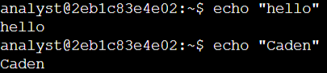
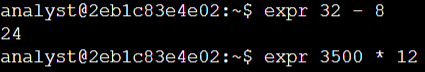
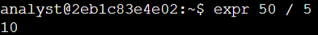

# Lab #2: Working with Input and Output in the Linux Bash Shell

**Platform**: Google Cybersecurity Certificate  
**Lab Focus**: Input/Output Commands and Arithmetic Operations in the Bash Shell

---

## 🧠 Lab Summary

This lab focused on using foundational Bash commands to generate and manipulate output in a Linux shell environment. These basic skills are essential for navigating and interacting with the command line efficiently.

---

## ✅ Key Tasks and Learnings

### Generated Output with `echo`
Practiced using the `echo` command to print text to the shell. Tested both unquoted and quoted strings to understand how quotation marks help group words or special characters as a single argument.

### Performed Calculations with `expr`
Used the `expr` command to perform simple arithmetic operations. This included subtraction (e.g., identifying false positive alerts) and multiplication (e.g., estimating annual login attempts), reinforcing how spacing between operands is necessary in shell arithmetic.

### Cleared the Shell with `clear`
Used the `clear` command to wipe the shell screen, creating a clean workspace for continued input.

### Explored Optional Exercises
Applied `echo` and `expr` independently to generate custom outputs and perform additional calculations. 

---

## 💻 Skills Demonstrated

- Proficient use of `echo` for text output  
- Basic arithmetic with `expr` for shell-based calculations  
- Shell management using the `clear` command  
- Understanding of input/output structure and syntax in Bash  

---

## 🔁 Reflections

These tasks helped build confidence in interacting with the Linux terminal and prepared me for more complex scripting and system management tasks.

