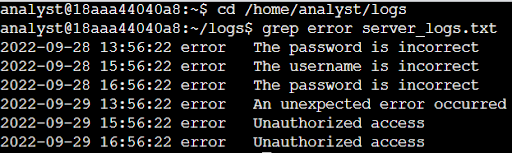
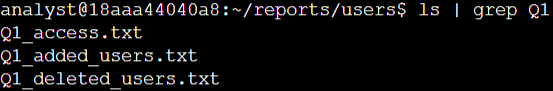
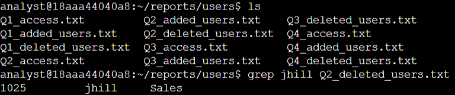
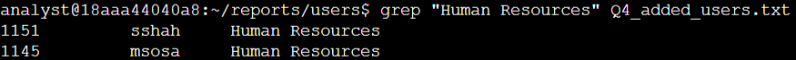

# Lab #4: Searching and Filtering Files with grep in the Linux Bash Shell

**Platform**: Google Cybersecurity Certificate  
**Lab Focus**: Text Searching and Filtering with grep in the Bash Shell

---

## 🧠 Lab Summary

This lab focused on using the grep command in a Linux environment to efficiently search for specific content within files and filter file names based on patterns. These techniques are vital for system monitoring, user management, and log file analysis.

---

## ✅ Key Tasks and Learnings

- Navigated to the /home/analyst/logs directory and used grep to extract all lines containing the string "error" from server_logs.txt, identifying the number of error messages present in the system logs.

- Accessed the /home/analyst/reports/users directory and used piped commands (ls | grep) to list files whose names contained the strings "Q1" and "access", demonstrating the ability to locate targeted files quickly based on naming conventions.

- Searched within Q2_deleted_users.txt for a specific username (jhill) and analyzed Q4_added_users.txt to identify users added to the Human Resources department, using quoted strings to handle multi-word search terms.

---

## 💻 Skills Demonstrated

- Filtering log data using grep  
- Piping output with | to refine search results  
- Case-sensitive and multi-word string searching  
- Navigating directories with cd and listing contents using ls  
- Reading specific file contents with precision using cat and grep  

---

## 🔁 Reflections

These exercises deepened my proficiency with Linux text processing tools and reinforced best practices for managing and extracting meaningful insights from system files and logs.
