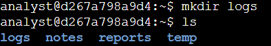
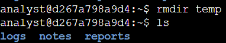
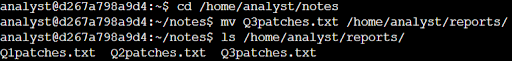
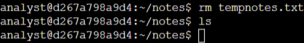
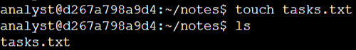
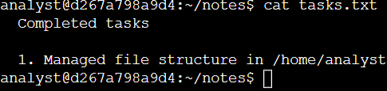

# Lab #5: Managing Directories and Files in the Linux Bash Shell

**Platform**: Google Cybersecurity Certificate  
**Lab Focus**: Directory and File Management in the Bash Shell

---

## 🧠 Lab Summary

This lab provided hands-on experience with fundamental Linux Bash commands for managing directories and files, including creating, moving, removing, and editing files. These essential skills are key to organizing and maintaining a structured file system in any Linux environment.

---

## ✅ Key Tasks and Learnings

- Used the `mkdir` command to create a new subdirectory named `logs` within the `/home/analyst directory`. Verified its successful creation by listing the directory contents.

- Deleted the `temp` directory from `/home/analyst` using `rm -r`, and confirmed its removal through directory listing.

- Moved `Q3patches.txt` from the `notes` directory to the reports directory, aligning file organization with the reporting structure and ensuring all quarterly reports were in one location.

- Removed `tempnotes.txt` from the `notes` directory to declutter the workspace and confirmed the directory was empty afterward.

- Used the `touch` command to create an empty `tasks.txt` file in the notes directory, intended for tracking completed actions.

- Opened `tasks.txt` using the `nano` text editor and added task notes. Saved and exited the editor using standard key commands and displayed the file content to confirm successful edits.

---

## 💻 Skills Demonstrated

- Directory creation and removal with `mkdir` and `rm -r`  
- File moving and deletion using `mv` and `rm`  
- File creation with `touch`  
- Basic text editing in the terminal with `nano`  
- Verification of actions using `ls` and `cat`  
- Shell cleanup with `clear` for improved readability  

---

## 🔁 Reflections

These tasks reinforced the practical application of core file management operations in Linux and built confidence in maintaining organized and functional directory structures.
