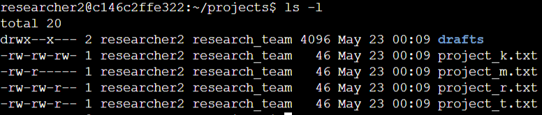
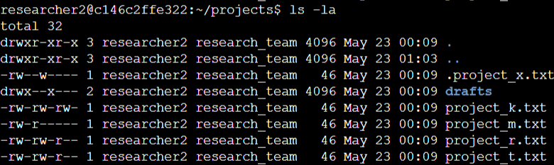
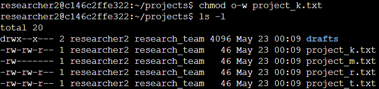
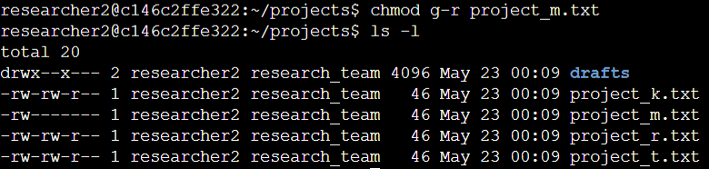
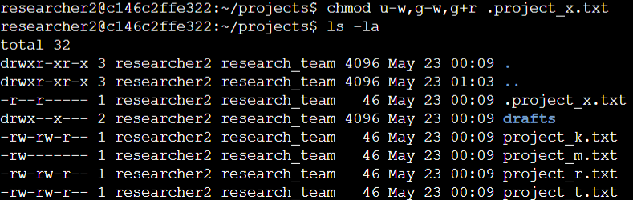
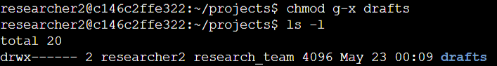

# Lab #6: Managing File and Directory Permissions in Linux

**Platform**: Google Cybersecurity Certificate  
**Lab Focus**: File and Directory Permissions Management in Linux

---

## 🧠 Lab Summary

This lab provided hands-on experience with examining and changing file and directory permissions in a Linux environment. These essential skills are critical for maintaining security and ensuring that files are only accessible by the appropriate users and groups.

---

## ✅ Key Tasks and Learnings

- Navigated to the `/home/researcher2/projects` directory and listed the contents, reviewing file permissions to understand access levels for different users and groups. Identified the group owning the files and checked for hidden files, noting which files were accessible or restricted.

- Examined the files for any incorrect permissions that allowed unauthorized access. Used the `chmod` command to remove write permissions for "other" users on files like `project_k.txt`, and restricted group access to the `project_m.txt file`, ensuring only the owner had full access. Reviewed and modified the permissions of the hidden file `.project_x.txt`, ensuring it was readable by the user and group, but not writable by anyone.

- Checked and modified the permissions of the `drafts` subdirectory within `/home/researcher2/projects`, ensuring that only the `researcher2` user had access and that the group had no permissions to execute or access files in the directory.

---

## 💻 Skills Demonstrated

- Viewing and interpreting file and directory permissions using `ls -l`  
- Modifying file permissions with `chmod` to control user, group, and other access  
- Managing access to hidden files and directories  
- Strengthening system security by removing unauthorized permissions  

---

## 🔁 Reflections

These tasks reinforced my understanding of Linux file permissions and access control, key skills for managing security and maintaining proper file system structure in any Linux environment.
