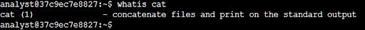
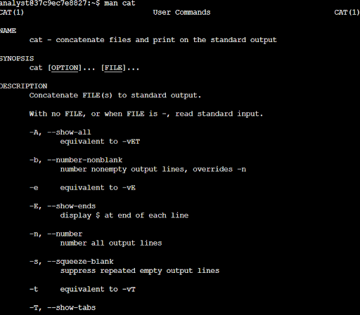
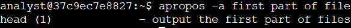
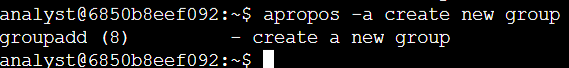

# Lab #8: Learning About Linux Commands Using Help Utilities

**Platform**: Google Cybersecurity Certificate  
**Lab Focus**: Learning Commands with Help Utilities

---

## 🧠 Lab Summary

This lab provided hands-on experience with several tools that help users learn about or recall the purpose, syntax, and options of Linux commands. Mastery of these utilities is essential for navigating the Linux shell effectively and independently.

---

## ✅ Key Tasks and Learnings

- **Retrieved Command Descriptions with `whatis`:**  
Used the `whatis` command to quickly understand the function of `cat`, confirming it is used to concatenate files and display their content.

- **Accessed Manual Pages with `man`:**  
Explored the `cat` and `useradd` commands using the `man` command, learning how to view detailed documentation and options for each. For example, learned that the `-n` or `-b` options can be used to number lines in `cat`, and `-e` sets an account expiration in `useradd`.

- **Searched Commands with `apropos`:**  
Used the `apropos` command to search for commands related to keywords like "first part file," identifying `head` as the command used to display the beginning of a file.

- **Differentiated File and Directory Removal Commands:**  
Reviewed the `rm` and `rmdir` commands using `whatis` or `man`, clarifying that `rm` removes files or non-empty directories (with options), while `rmdir` only removes empty directories.

- **Identified Group Creation Command:**  
Searched for the appropriate command to create a new group using keyword-based search, confirming that `groupadd` is the correct command to use.

---

## 💻 Skills Demonstrated

- Quickly retrieving command summaries with `whatis`  
- Accessing in-depth command documentation via `man`  
- Using `apropos` for keyword-based command discovery  
- Understanding command distinctions (`rm` vs. `rmdir`)  
- Identifying appropriate commands for user and group management  

---

## 🔁 Reflections

This lab strengthened my ability to independently explore and understand Linux commands, a key competency for troubleshooting, scripting, and system administration.
