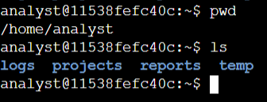
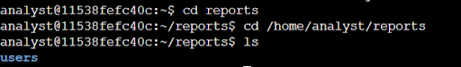
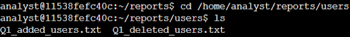
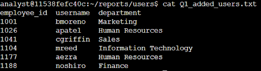
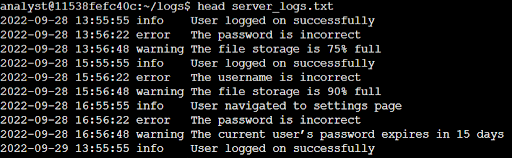

# Lab #3: Navigating Directories and Reading Files in the Linux Bash Shell

**Platform**: Google Cybersecurity Certificate  
**Lab Focus**: File System Navigation and File Reading in the Bash Shell

---

## 🧠 Lab Summary

This lab provided practical experience with essential Bash commands for navigating the Linux file system and working with files and directories. These foundational skills are critical for efficiently managing and analyzing system data.

---

## ✅ Key Tasks and Learnings

### Checked Current Directory Information
Used the `pwd` command to verify the current working directory and `ls` to list its contents. This helped identify the structure and contents of the `/home/analyst` directory.

### Changed Directories and Listed Subdirectories
Navigated to the `/home/analyst/reports` directory using the `cd` command and identified subdirectories within it by listing its contents.

### Located and Read File Contents
Navigated into the `/home/analyst/reports/users` directory and used `ls` and `cat` to list files and read the full contents of `Q1_added_users.txt`, extracting specific user and department information from the data.

### Displayed Partial File Contents
Used the `head` command to view the first 10 lines of a log file located in `/home/analyst/logs/server_logs.txt`, identifying warning messages within those lines.

---

## 💻 Skills Demonstrated

- Navigation of directory structures with `cd`  
- Verification of current location with `pwd`  
- Listing directory contents using `ls`  
- Viewing file contents with `cat` and `head` 
- Extracting relevant information from system files and logs  

---

## 🔁 Reflections

These tasks strengthened my understanding of the Linux file system and built confidence in using core commands to explore and analyze directories and data through the terminal.
