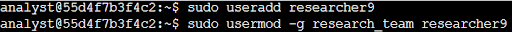
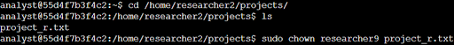
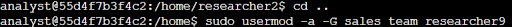
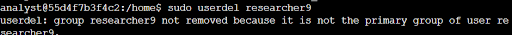

# Lab #7: Managing Users and Groups in the Linux Bash Shell

**Platform**: Google Cybersecurity Certificate  
**Lab Focus**: User and Group Management in the Bash Shell

---

## 🧠 Lab Summary

This lab provided practical experience with essential Linux user management tasks, including creating and deleting users, assigning group memberships, and modifying file ownership. These are foundational skills for administering multi-user Linux systems securely and efficiently.

---

## ✅ Key Tasks and Learnings
 
- Used the `useradd` command to create a new user account for `researcher9`. Assigned them to the `research_team` group as their primary group using the `usermod -g` command.

- Changed the ownership of the `project_r.txt` file, located in `/home/researcher2/projects`, to `researcher9` using the `chown` command, ensuring the new user had full control of their assigned project file.

-Expanded `researcher9`'s responsibilities by adding them to the `sales_team` as a secondary group using the `usermod -a -G` command, without affecting their existing group memberships.

- Removed the `researcher9` user from the system using the `userdel` command. Also deleted the associated group with `groupdel` to clean up the environment, following good administrative practice.

---

## 💻 Skills Demonstrated

- Creating users with `useradd`  
- Managing group memberships with `usermod`  
- Changing file ownership using `chown`  
- Deleting users and groups with `userdel` and `groupdel`  
- Understanding and maintaining proper user-group-file relationships in a Linux system  

---

## 🔁 Reflections

This lab strengthened my confidence in managing users and their access within Linux, a key responsibility in system administration and organizational security.
