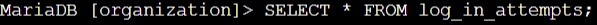
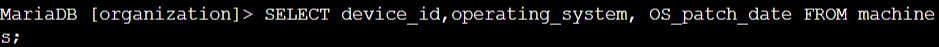
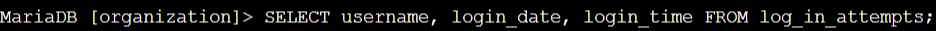

# Lab #1: Querying a Database to Retrieve and Sort Data

**Platform**: Google Cybersecurity Certificate  
**Lab Focus**: Foundational SQL Queries for Data Retrieval and Sorting

---

## 🧠 Lab Summary

This lab provided hands-on experience with foundational SQL commands used to retrieve and organize data from a relational database. These skills are essential for analysts, database administrators, and cybersecurity professionals who need to extract insights or identify anomalies from system records.

---

## ✅ Key Tasks and Learnings

- Retrieved full table data using `SELECT *` to return all available data from the `machines` and `log_in_attempts` tables, confirming their structure and content.  
  

- Used `SELECT` with specific column names (e.g., `device_id`, `email_client`, `OS_patch_date`) to retrieve targeted information.  
  

- Investigated login attempts based on geographic origin and time by querying `log_in_attempts`, helping identify abnormal or unauthorized activity.  
  

- Applied the `ORDER BY` clause to sort records by `login_date` and `login_time`, supporting timeline-based analysis of login behavior.  
  

---

## 💻 Skills Demonstrated

- Formulating SQL queries with `SELECT`  
- Selecting specific and all columns in a table  
- Using `ORDER BY` to sort data  
- Analyzing system activity from structured data  
- Identifying potential security anomalies in login records  

---

## 🔁 Reflections

This lab strengthened my ability to query relational databases efficiently and accurately, laying a solid foundation for advanced data analysis and system auditing tasks.
