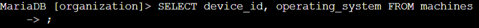
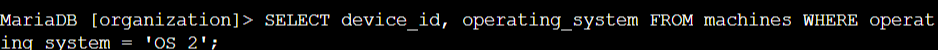

# Lab #2: Filtering and Retrieving Specific Records from a SQL Database

**Platform**: Google Cybersecurity Certificate  
**Lab Focus**: Filtering Records and Selective Data Retrieval with SQL

---

## 🧠 Lab Summary

This lab provided hands-on experience with writing SQL queries to selectively retrieve and filter data from relational databases. These are essential skills for data analysis, troubleshooting, and system auditing.

---

## ✅ Key Tasks and Learnings

- Queried specific columns (`device_id` and `operating_system`) from the `machines` table using `SELECT`, confirming the structure of device records and identifying a total of 200 machines.  
  

- Filtered data using the `WHERE` clause to isolate machines running `'OS 2'`, which returned 80 devices that require system updates. Retrieved employee records from the `employees` table by filtering the `department` column, identifying office details for staff in both the Finance and Sales departments.  
  

- Used a targeted `WHERE` clause to find the employee associated with a specific office, and then applied the `LIKE` operator to find all employees located in the South building, returning departmental context for follow-up action.  
  

---

## 💻 Skills Demonstrated

- Selecting specific data from tables using `SELECT`  
- Filtering query results with `WHERE`  
- Using `LIKE` for partial string matching  
- Identifying targeted user or device information in response to issues  
- Supporting operational decisions with structured data queries  

---

## 🔁 Reflections

This lab strengthened my ability to extract and filter relevant data using SQL, providing practical insights into how databases support operational and security workflows.
