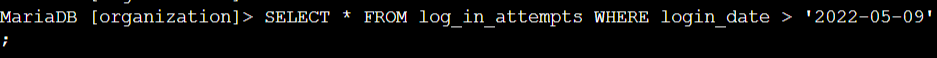
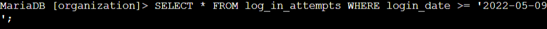
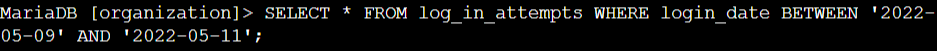
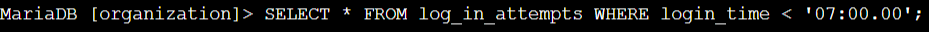
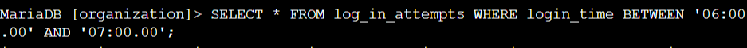
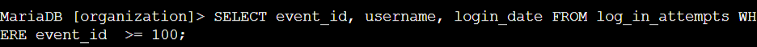
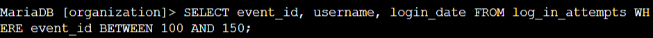

# Lab #3: Filtering Login Attempts Using SQL

**Platform**: Google Cybersecurity Certificate  
**Lab Focus**: Applying SQL Filters to Detect Patterns in Login Data

---

## 🧠 Lab Summary

This lab focused on filtering login records from a database by applying date, time, and numeric conditions. These filtering techniques help detect unusual activity and analyze access patterns.

---

## ✅ Key Tasks and Learnings

- Filtered login attempts after a specific date using `WHERE login_date > '2022-05-09'`, identifying 125 relevant entries, and expanded the query to include logins on the same date using `>=`, retrieving 165 results.  
  
  

- Used the `BETWEEN` operator to focus on login activity between `'2022-05-09'` and `'2022-05-11'`, retrieving 123 attempts within that time frame.  
  

- Filtered data by `login_time` to identify attempts made before working hours (`< '07:00:00'`) and refined the scope using `BETWEEN '06:00:00' AND '07:00:00'` to detect early-morning access.  
  
  

- Queried login attempts by `event_id`, starting with `>= 100`, then refining the filter with `BETWEEN 100 AND 150` to narrow the dataset and focus on specific events.  
  
  

---

## 💻 Skills Demonstrated

- Filtering SQL query results using `WHERE` with `>`, `>=`, `<`, `=`, and `BETWEEN ... AND`  
- Retrieving login data by specific dates and times to investigate patterns  
- Working with different data types in filters, including `DATE`, `TIME`, and integers  
- Isolating important fields using `SELECT column1, column2...` for targeted output  

---

## 🔁 Reflections

This lab provided essential practice in filtering structured data, a critical skill for identifying anomalies, tracking access, and supporting security operations through SQL analysis.

