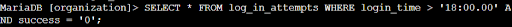
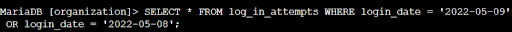
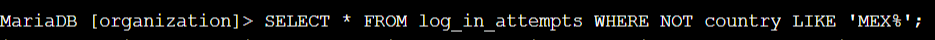
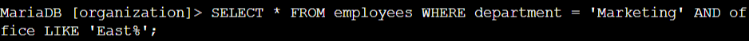
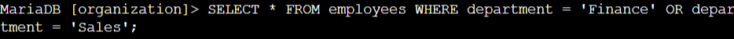
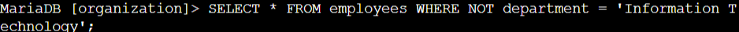

# Lab #4(SQL): Filtering Records Using Logical Operators in SQL

**Platform**: Google Cybersecurity Certificate  
**Lab Focus**: SQL Logical Operators (`AND`, `OR`, `NOT`)

---

## 🧠 Overview

This lab focused on using logical operators like `AND`, `OR`, and `NOT` to filter login activity and employee data. These skills are essential for narrowing down datasets during investigations and routine data checks.

---

## ✅ Key Tasks and Learnings

- Filtered failed login attempts after business hours 
  Used `WHERE login_time > '18:00' AND success = 0`, identifying 19 such records.  
  

- Retrieved login attempts on specific dates  
  Queried with `WHERE login_date = '2022-05-09' OR login_date = '2022-05-08'`, returning 44 records.  
  

- Excluded logins from Mexico using NOT LIKE  
  Applied `NOT LIKE 'MEX%'` on the `country` column, identifying 144 login attempts that did not originate from Mexico.  
  

- Queried employees in Marketing from the East building
  Used `WHERE department = 'Marketing' AND office LIKE 'East%'` to find employees like `elarson`.  
  

- Retrieved employees from Finance or Sales  
  Used `WHERE department = 'Finance' OR department = 'Sales'` to ensure both groups were updated.  
  

- Filtered out IT department employees  
  Applied `WHERE NOT department = 'Information Technology'`, identifying 161 employees needing updates.  
  

---

## 💻 Skills Demonstrated

- Applied the `AND` operator to enforce multiple conditions in queries  
- Used `OR` to return data matching either of two conditions  
- Leveraged `NOT` and `LIKE` for pattern exclusion in filters  
- Practiced combining logic with string and Boolean data types  
- Retrieved targeted records for different departments and operational tasks  

---

## 🔁 Reflection

This lab helped reinforce logical filtering in SQL, an essential capability for precise data analysis, especially in security investigations and administrative reporting.
