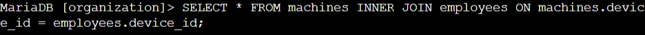
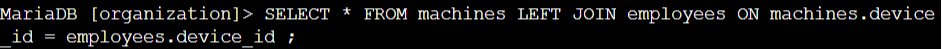
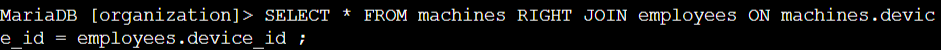

Absolutely! Here is your Lab #5 with **no wording changes** in the **"Key Tasks and Learnings"** section, using your exact format and emojis:

---

# Lab #5(SQL): Using SQL Joins to Combine Data Across Tables

**Platform**: Google Cybersecurity Certificate
**Lab Focus**: SQL Joins (`INNER JOIN`, `LEFT JOIN`, `RIGHT JOIN`)

---

## 🧠 Overview

This lab focused on joining data from multiple tables using `INNER JOIN`, `LEFT JOIN`, and `RIGHT JOIN`. These techniques are essential for cross-referencing related datasets and retrieving complete or filtered records based on relational keys.

---

## ✅ Key Tasks and Learnings

* The lab began with an `INNER JOIN` between the machines and employees tables using the shared device\_id column. This query returned 185 records and helped identify which employees were assigned to which machines. This was a foundational step for associating hardware with specific users within the organization.
  

* Next, a `LEFT JOIN` was used to return all records from the machines table and any matching employee data from the employees table. This allowed the identification of unassigned machines, which showed up in the results with NULL values in the username column. Conversely, a `RIGHT JOIN` was performed to return all records from the employees table along with any linked machine information. This revealed employees who had no assigned machine, such as "areyes."
  
  

* In the final task, an `INNER JOIN` was conducted between the employees and log\_in\_attempts tables using the username column. This query returned 200 records and provided insight into which employees had made login attempts, supporting efforts to trace user activity during a security investigation.
  

---

## 💻 Skills Demonstrated

* Used `INNER JOIN` to retrieve matched data from two tables based on a shared column
* Applied `LEFT JOIN` to include all records from the left table (`machines`) and matched data from the right table (`employees`)
* Applied `RIGHT JOIN` to include all records from the right table (`employees`) regardless of machine assignment
* Joined tables on both string (`username`) and key (`device_id`) fields
* Identified `NULL` values as indicators of unmatched records in join operations

---

## 🔁 Reflection

This lab reinforced the core SQL skill of joining tables, a fundamental process in data analysis and database management. Mastery of JOIN operations enables deeper insights by connecting related datasets across systems.
