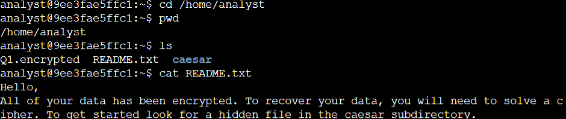
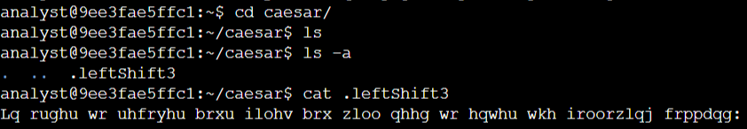
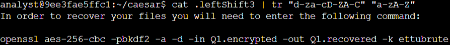
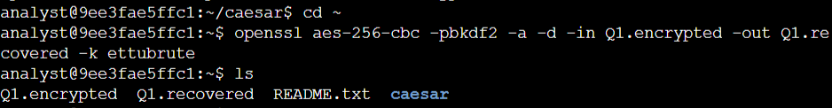
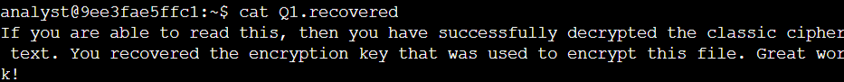

# Lab #1: Decrypting Files and Hidden Messages in the Linux Shell

**Platform**: Google Cybersecurity Certificate
**Lab Focus**: File System Navigation, Caesar Cipher, `openssl` Decryption

---

## 🧠 Overview

This lab focused on exploring the Linux file system to locate, read, and decrypt hidden or encrypted files. It introduced key Bash commands used to list files (including hidden ones), decode a Caesar cipher, and decrypt encrypted files using `openssl`.

---

## ✅ Key Tasks and Learnings

- The lab began by navigating the /home/analyst directory to locate and read a README.txt file, which provided the initial hint about a hidden file. Using `ls` and `cat`, the contents of the home directory were explored, and the caesar subdirectory was identified as the next step.  
  

- Within the caesar subdirectory, the command `ls -a` revealed a hidden file named `.leftShift3`. This file was encrypted using a Caesar cipher with a left shift of three. The command `cat .leftShift3 | tr "d-za-cD-ZA-C" "a-zA-Z"` was used to successfully decrypt its contents, revealing the next decryption instruction.
  

- Returning to the home directory, the encrypted file `Q1.encrypted` was decrypted using the `openssl aes-256-cbc -pbkdf2 -a -d -in Q1.encrypted -out Q1.recovered -k ettubrute` command. This produced a readable file, `Q1.recovered`, containing the final message.
  

---

## 💻 Skills Demonstrated

* Used `ls`, `ls -a`, and `cat` to locate and read visible and hidden files
* Decrypted a Caesar cipher using the `tr` command to apply character substitutions
* Applied `openssl` to decrypt a base64-encoded, AES-256-CBC encrypted file using a password
* Navigated directories using `cd`, and managed paths effectively in a shell environment

---

## 🔁 Reflection

This lab provided hands-on experience with basic file system navigation and introduced practical methods for handling encrypted data using the Linux command line—valuable skills for foundational cybersecurity and systems analysis tasks.
