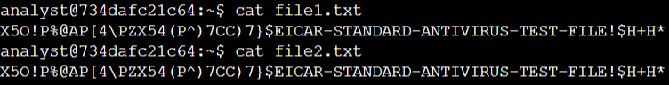
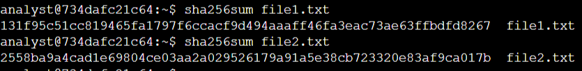
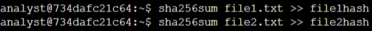
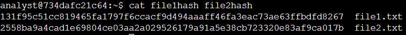
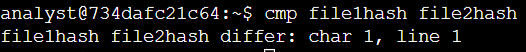

# Lab #2: Hash Comparison and File Integrity Validation in Linux

**Platform**: Google Cybersecurity Certificate
**Lab Focus**: `sha256sum`, `cmp`, File Integrity Check

---

## 🧠 Overview

This lab focused on verifying data integrity by generating and comparing cryptographic hashes of files using common Linux shell commands. It demonstrated how files that appear identical can differ in subtle ways detectable through hashing.

---

## ✅ Key Tasks and Learnings

- The lab began in the /home/analyst directory, where two files—file1.txt and file2.txt—contained visually identical test string data. Using the `cat` command confirmed their contents looked the same. However, after running `sha256sum` on both files, it was revealed that the resulting hashes were different, indicating underlying discrepancies.
  
  

- The hash values were then redirected into two new files, file1hash and file2hash, using output redirection (`>>`). The `cat` command was used to display these hash files, visually confirming the differences. Finally, the `cmp` command was run to compare the files byte by byte, which reported the exact character and line of the first mismatch, further validating that file1.txt and file2.txt were not identical.
  
  
  

---

## 💻 Skills Demonstrated

* Generated file hashes using `sha256sum` to detect integrity differences
* Used `cat` to inspect file contents, including hash values
* Redirected output to new files for further comparison
* Compared files byte by byte using `cmp` to pinpoint exact differences

---

## 🔁 Reflection

This lab demonstrated the importance of hash validation as a tool for ensuring data integrity, especially in contexts where file contents might be tampered with or corrupted without obvious visible changes.
