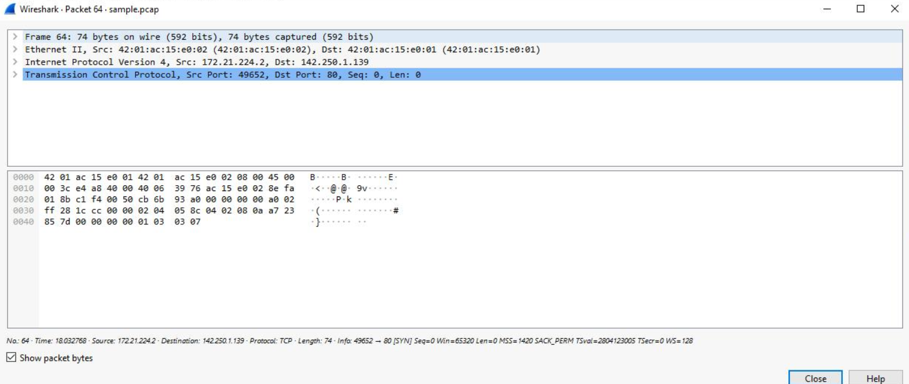
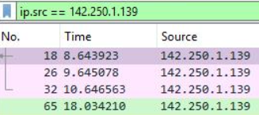

# Lab #1: Exploring and Filtering Network Traffic with Wireshark

**Platform**: Google Cybersecurity Certificate  
**Lab Focus**: `Wireshark`, Packet Filtering, Protocol Analysis

---

## 🧠 Overview

This lab provided hands-on experience with using Wireshark, a powerful network analysis tool, to explore, filter, and inspect network packet data. You learned how to open packet capture files, apply display filters, and examine network traffic across various protocols, including TCP, ICMP, and DNS.

---

## ✅ Key Tasks and Learnings

- Opened and Explored a Packet Capture File: Opened a .pcap file using Wireshark and reviewed its main interface, which displays captured network packets along with their metadata such as source/destination IPs, protocol types, timestamps, and brief info summaries.
  

- Applied Basic IP Address Filter and Inspected Packets: Filtered traffic using `ip.addr == 142.250.1.139` and examined protocol layers (Frame, Ethernet II, IPv4, TCP) in a selected packet. Identified the TCP destination port as 80, and explored TCP flags.  
  
  

- Filtered Traffic by Source, Destination, and MAC Address: Used filters to isolate traffic by:
  Source IP: `ip.src == 142.250.1.139`,
  Destination IP: `ip.dst == 142.250.1.139`,
  MAC Address: `eth.addr == 42:01:ac:15:e0:02`.
  Identified TCP as the internal protocol for MAC-related packets in the IPv4 section.  
  
  
  

- Explored DNS Query and Response Packets: Filtered DNS traffic using `udp.port == 53`. Drilled into DNS query and response data and found that the IP address `142.250.1.139` was returned for a query to `opensource.google.com`.
  

- Examined TCP Packets and Payload Data: Used `tcp.port == 80` to analyze HTTP traffic. Retrieved the following key details from a packet: Time to Live: 64, Frame Length: 54 bytes, Header Length: 20 bytes, Destination Address: 169.254.169.254. Also filtered for packets containing the word `"curl"` using `tcp contains "curl"` to identify traffic generated by a command-line web request.
  
  

---

## 💻 Skills Demonstrated

* Opening and navigating `.pcap` files in Wireshark
* Filtering packets by IP address, port number, and MAC address
* Identifying and interpreting protocol data (ICMP, TCP, UDP, DNS)
* Inspecting packet structure across OSI layers
* Using search filters to find specific packet contents
* Reading DNS queries and HTTP payloads

---

## 🔁 Reflection

These tasks reinforced the practical use of Wireshark for real-world network analysis and built foundational skills for identifying and troubleshooting traffic across different network layers.
