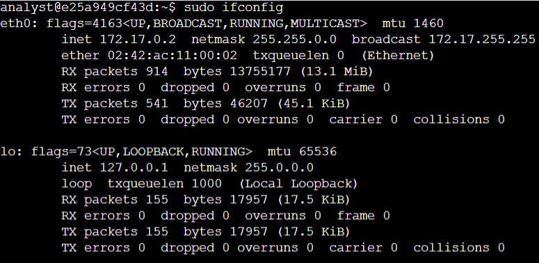
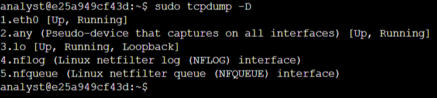
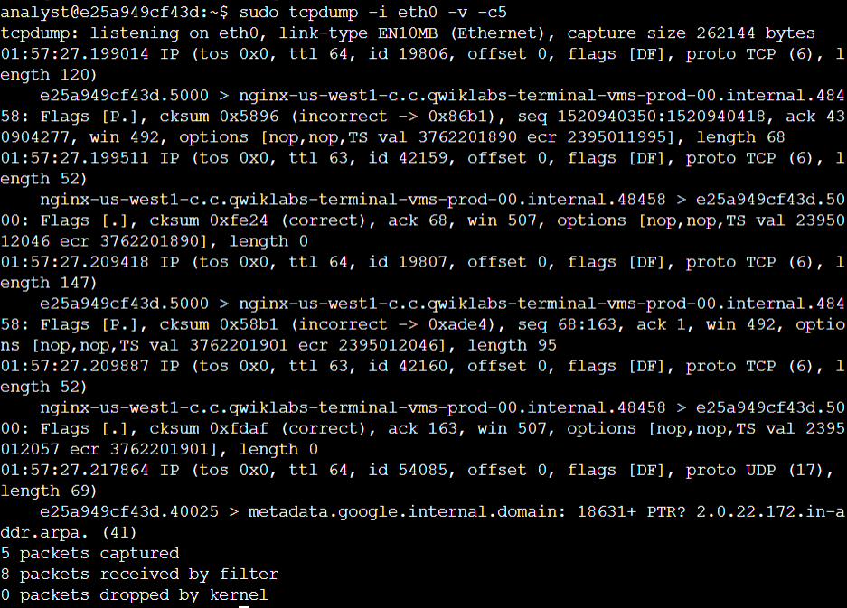
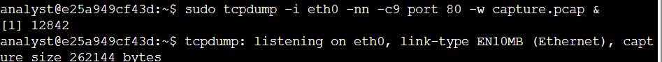
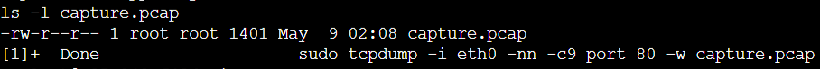
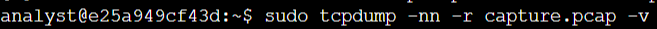
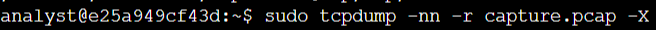

# Lab #2: Capturing and Inspecting Network Traffic with tcpdump

**Platform**: Google Cybersecurity Certificate
**Lab Focus**: `tcpdump`, Network Traffic Capture and Analysis

---

## 🧠 Overview

This lab provided hands-on experience with using the tcpdump command-line tool to identify network interfaces, capture live network traffic, save packet data to a file, and analyze that data in both human-readable and hexadecimal formats. These skills are essential for network diagnostics and security analysis.

---

## ✅ Key Tasks and Learnings

- Identified Available Network Interfaces: Used the `ifconfig` command to view available network interfaces and confirmed the use of `eth0` for capturing packet data. Also used `tcpdump -D` to list available interfaces on systems that might not include ifconfig.
  
  

- Captured Live Network Traffic with tcpdump: Ran `tcpdump -i eth0 -v -c5` to capture and display five live packets on the `eth0` interface with verbose output, providing insight into protocol fields such as TTL, sequence numbers, and TCP flags.
  

- Examined Packet Details in Live Output: Analyzed packet output fields including timestamps, protocol types, source and destination IPs with port numbers, flags, checksums, and sequence/acknowledgment values to better understand packet structure and flow.
  

- Captured Specific Network Traffic to a File: Used `tcpdump -i eth0 -nn -c9 port 80 -w capture.pcap &` to capture nine packets of HTTP traffic on port 80 and save them to a file named `capture.pcap`. Generated HTTP traffic using `curl` to ensure capture activity.
  

- Verified and Filtered Captured Packet Data: Confirmed the capture file's existence using `ls -l`.
  Analyzed the saved data using `tcpdump -nn -r capture.pcap -v` to read human-readable packet headers and `tcpdump -nn -r capture.pcap -X` to view detailed hexadecimal and ASCII content for forensic analysis.
  
  

---

## 💻 Skills Demonstrated

* Identifying network interfaces with `ifconfig` and `tcpdump -D`
* Capturing live packet data on specific interfaces using `tcpdump`
* Filtering traffic based on protocol, port, and packet count
* Saving packet data to a `.pcap` file for offline analysis
* Viewing detailed packet header information and raw data formats

---

## 🔁 Reflection

These tasks built foundational skills for network traffic inspection and security analysis, reinforcing the ability to capture, interpret, and analyze packets using `tcpdump` in real-world scenarios.
