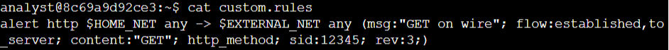
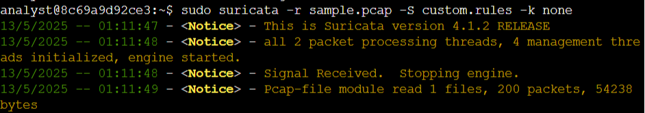
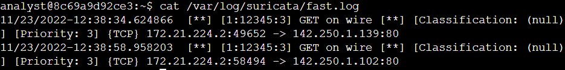
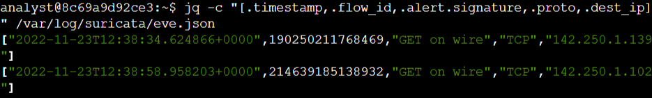
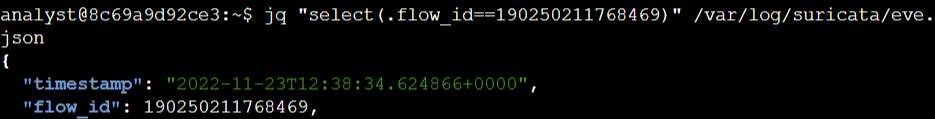

# Lab #1: Creating and Triggering Custom Rules in Suricata

**Platform**: Google Cybersecurity Certificate  
**Lab Focus**: `Suricata`, Custom IDS Rules and Alert Analysis

---

## 🧠 Overview

This lab provided practical experience in creating, analyzing, and triggering custom intrusion detection rules using Suricata, a powerful open-source network threat detection engine. These skills are vital for monitoring suspicious network activity and improving an organization's network defense posture.

---

## ✅ Key Tasks and Learnings

- Examined a custom Suricata rule by viewing the `custom.rules` file located in `/home/analyst` to analyze a user-defined Suricata rule. The rule was broken down into its three components: action, header, and rule options. It was designed to trigger an alert when an HTTP GET request is detected leaving the home network to an external destination. The rule used variables like `$HOME_NET` and included parameters such as `msg`, `content`, `flow`, `sid`, and `rev`.
  
  

- Triggered a custom rule by running Suricata against a sample PCAP file (`sample.pcap`) using the custom rule set. Suricata generated alert entries in the `fast.log` file after processing packets that matched the rule. Each alert entry displayed details such as the timestamp, rule ID, message text ("GET on wire"), and source and destination IP information.
  

- Examined JSON-based alert output by viewing the `eve.json` file, Suricata’s primary structured log file. Used the `jq` tool to format and analyze the log data, making it easier to read and extract specific fields such as alert severity, timestamp, protocol, destination IP, and flow ID. Also practiced isolating event data based on a unique flow ID to correlate related network traffic.
  
  

---

## 💻 Skills Demonstrated

* Viewing and analyzing custom rule syntax in Suricata
* Running Suricata against packet capture files
* Interpreting alert logs in both `fast.log` and `eve.json` formats
* Using `jq` to extract and analyze structured JSON alert data

---

## 🔁 Reflection

These tasks reinforced my ability to write and test custom intrusion detection rules, interpret alert data, and correlate network activity—essential competencies for a security analyst working with IDS tools like Suricata.
